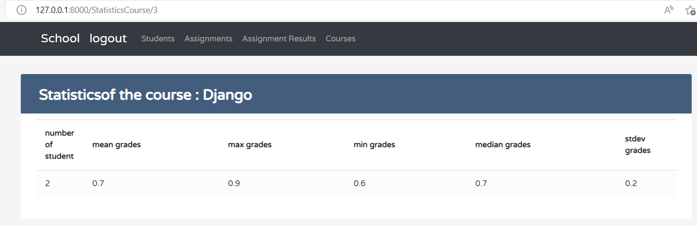

# automated-testing-django:
Manage a  group of students in a course. 
A group of students in a course will be assigned an assignment and produce a collection ofassignment results. The results will be used to figure out grade statistics(mean, max,min, median, stdev...).The grade they receive for their work on thea ssignment is entirely dependant on the student's energy level.If the student works on many assignments without sleeping their grade will suffer. 

# Tools:
- Python 3.9 
- Django
- poetry
- Flake8
- Coverage
- Pytest
- HTML/CSS/JS

# Steps:
* Poetry:
- poetry shell 
- poetry install

* virtaul env :
- python -m venv venv
- venv\Scripts\activate
- pip install -r requirements.txt
*database : (the used SGBD is postgresql "Pgadmin4" . the details of the database "name, port, password .." are in the file settings) 
- python manage.py makemigrations main
- python manage.py migrate
add superuser : 
- python manage.py createsuperuser
- python manage.py runserver
* to run the tests :
- pytest
You can also run the tests from github actions

# Screens:
#### list of students:
- for each student we can see his courses and grades , we can also assign a new assigment to him and add the hours of sleep he gets :

#### assigments :

#### manage courses :
- we can add one or more students to a course:

#### manage assigments results:

#### statistics:

